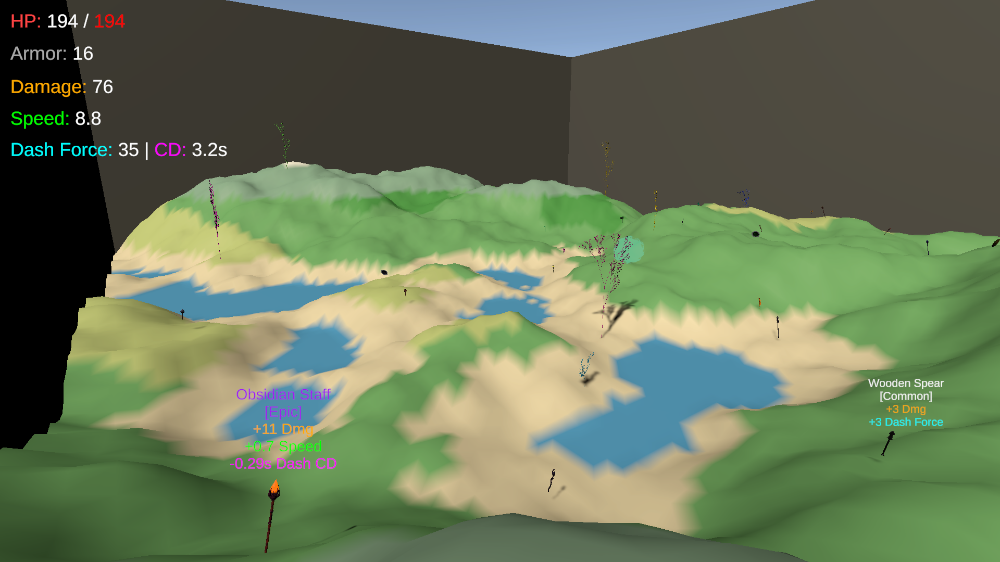
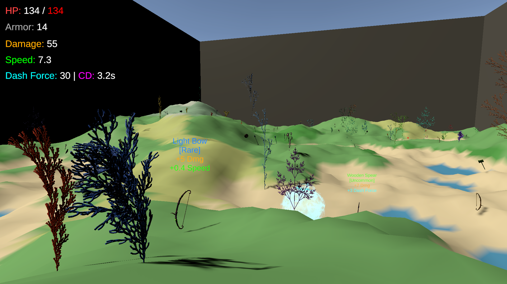
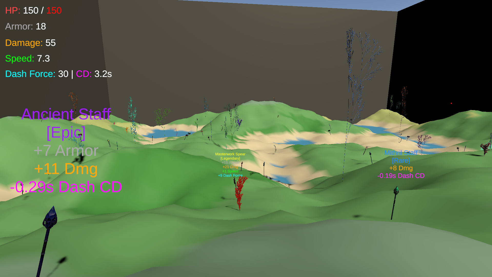
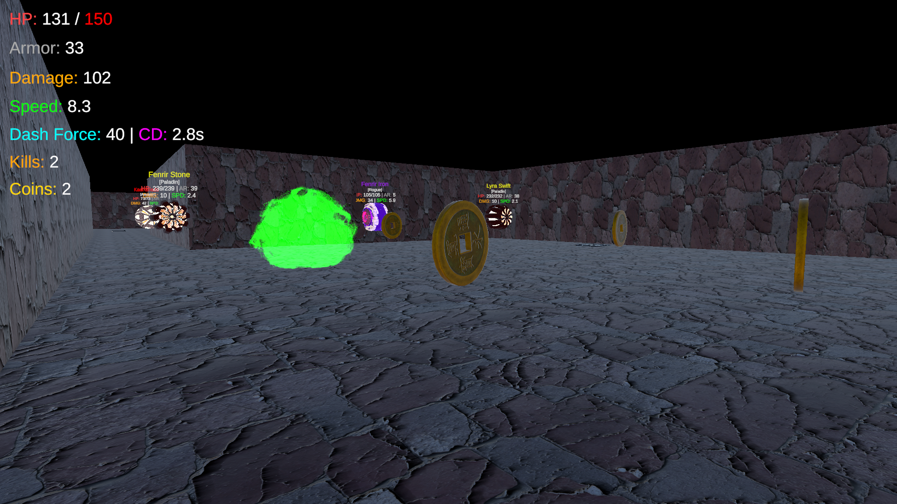
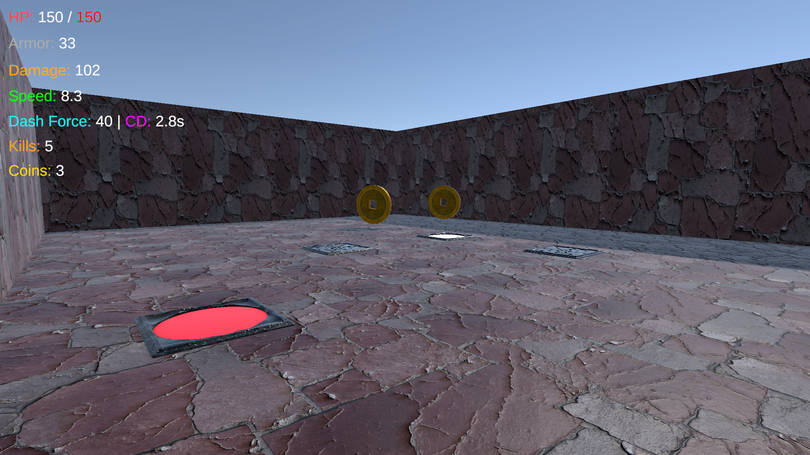
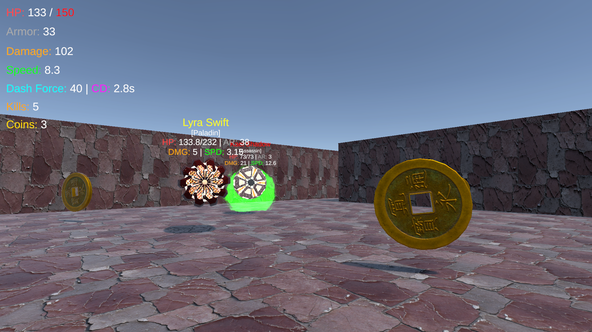
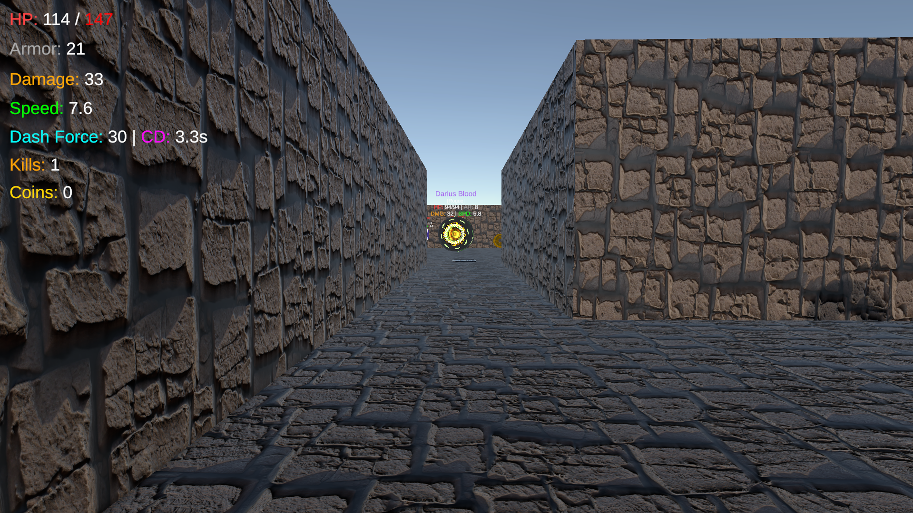
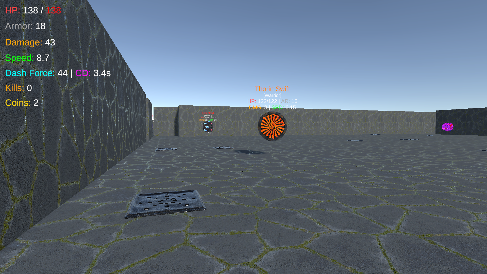

# 🌍 The Procedural Protocol

**The Procedural Protocol** is a small action-exploration game demo built in **Unity**, heavily driven by Procedural Content Generation (PCG). 

The project demonstrates how algorithmic world-building can create a unique experience every time you press play. As a player, you will explore a dynamically generated overworld, dive into unpredictable dungeons, fight enemies with randomized stats, collect various loot, and watch out for hidden traps.

> **Project Context:** This game was developed for the [Procedural Generation](https://ocw.cs.pub.ro/courses/gp) course, fulfilling the requirements of the [2026 Project Assignment](https://ocw.cs.pub.ro/courses/gp/tema).

## 📸 Gameplay Showcase

> *Check out some screenshots from the game:*
> 
> 
> 
> 
> 
> 
> 
> 
> 

## 🎮 Gameplay Features
* **Dynamic Overworld & Biomes:** Explore a vast terrain sculpted by Fractal Noise and ecologically distributed using the Whittaker climate model (elevation vs. moisture), featuring 10 distinct biomes.
* **Procedural Vegetation:** Discover flora generated via L-Systems (Lindenmayer Systems) with randomized branching, colors, and spatial raycast-placement.
* **Dungeons:** Enter portals to explore dungeons dynamically carved using the BSP algorithm and fully interconnected via A*.
* **Dynamic Entities & Loot:** Fight against 4 distinct NPC classes with procedurally generated stats. Collect 7 types of equipment scaled by 5 rarity tiers (Common to Legendary) featuring randomized stat boosts.
* **Day/Night Cycle:** The time of day directly affects enemy behavior at runtime -> enemies hit harder and move slower at night, and vice-versa during the day.
* **Deep Customization:** Take control of the algorithms. Use the Main Menu to tweak terrain dimensions, noise scale, flora/enemy density, dungeon complexity, and generation seeds before diving in.

## 🕹️ Controls

| Key | Action |
| :---: | :--- |
| **W A S D** | Move Character (Forward, Left, Backward, Right) |
| **SPACE** | Jump |
| **Q** | Dash Forward (Cooldown-based) |

## 📥 Download & Installation
You can download the latest playable build from the [Releases](../../releases) tab of this repository.

1.  Go to the **Releases** section on the right sidebar.
2.  Download the latest `.zip` file.
3.  Extract the archive to a folder on your PC.
4.  Run `The Procedural Protocol.exe` to play!

## 📚 Documentation

A complete **Technical Report and Documentation** can be found in the `Documentation` folder of this repository.

> **[📂 Click here to view the Documentation folder](./Documentation)**

## 🛠️ Built With
* **Unity Engine** (6000.3.11f1)
* **C#**

---
*Enjoy your infinite adventure!*
